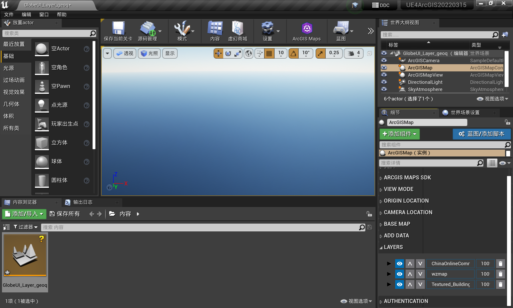

# 导入关卡

https://developers.arcgis.com/unreal-engine-sdk/get-started/

1. （只创建一次，已有则忽略）创建 UE4 ArcGIS 项目
2. （只安装一次，已有则忽略）在 UE4 4.27.2 里安装好 ArcGIS 插件
3. 复制关卡“GlobeUI_Layer_geoq.umap”到项目的“Content”文件夹下
4. 在 UE4 里打开项目
5. 在内容浏览器里双击加载所导入的关卡
6. 运行（Alt+P）

# 修改关卡

https://developers.arcgis.com/unreal-engine-sdk/layers/tutorials/add-layers-ui/

1. 在世界大纲视图里选择“ArcGISMap”
2. 修改细节里的图层
