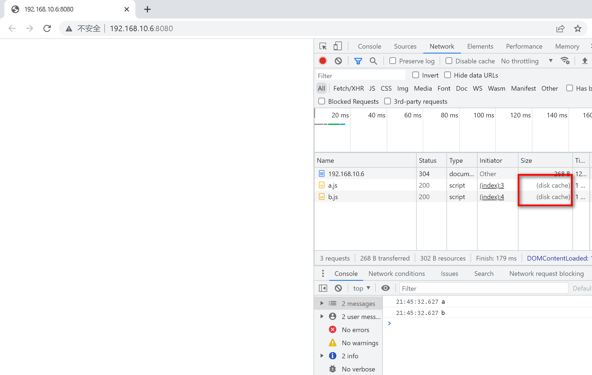

2022-03-16 21:48:04

使用 import 动态加载 js 时，浏览器是否会缓存。

https://developer.mozilla.org/zh-CN/docs/Web/JavaScript/Reference/Statements/import#导入默认值

```js
(async () => {
  if (somethingIsTrue) {
    const {
      default: myDefault,
      foo,
      bar,
    } = await import("/modules/my-module.js");
  }
})();
```

# 运行

```sh
npx http-server
# http://127.0.0.1:8080
```

# 结果

可以使用“disk cache”或“memory cache”


