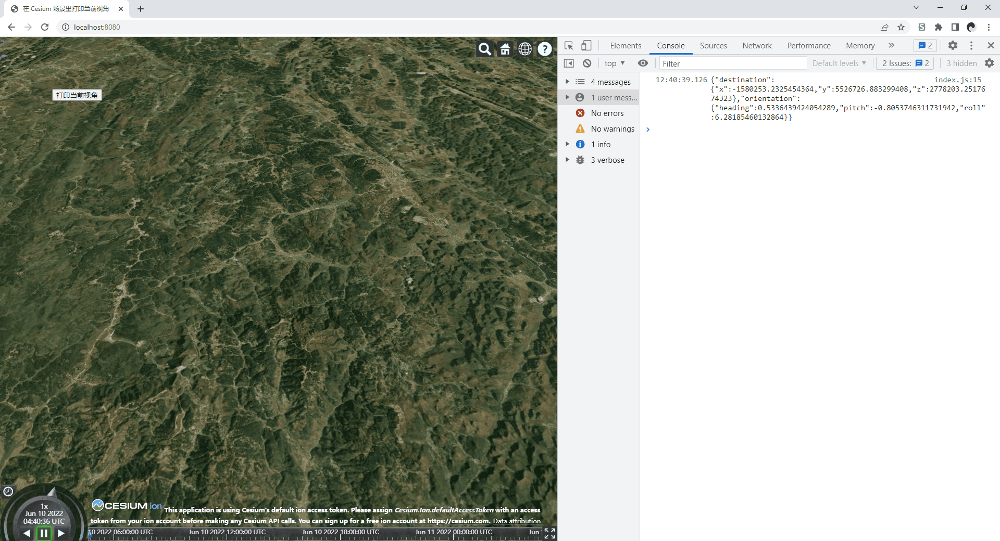

在 Cesium 场景里打印当前视角

# 安装

```sh
pnpm add @sundawning/cesium-log-camera-view
```

# 使用

```html
<script
  type="text/javascript"
  src="./node_modules/@sundawning/cesium-log-camera-view/index.js"
></script>
<script type="text/javascript">
  // 已经加载Cesium依赖，已经使用Cesium.Viewer创建了viewer
  Cesium.Plugins.SunDawning.log_camera_view(viewer);
</script>
```

# 使用打印的视角来设置视角

```js
viewer.camera.setView({
  destination: {
    x: -1580047.61070081,
    y: 5523168.041837127,
    z: 2775941.753210669,
  },
  orientation: {
    heading: 0.46157737888432493,
    pitch: -0.5245022100302306,
    roll: 0.0002878732439342002,
  },
});
```

# 一个测试页面

2022-06-10 12:45:19

```sh
pnpm run test
# http://127.0.0.1:8080
```


